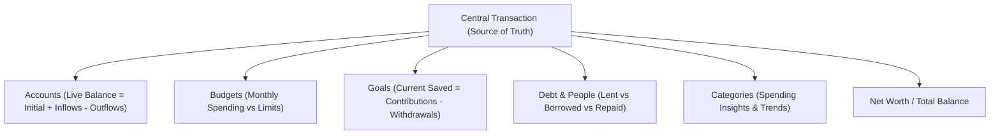

# Wallet (Native Jetpack Compose)

<p align="center">
  <a href="https://github.com/mrdarksidetm/Wallet/actions/workflows/android-ci.yml"></a>
  <a href="https://m3.material.io/"></a>
  <a href="https://developer.android.com/jetpack/compose"></a>
  <a href="https://developer.android.com/training/data-storage/room"></a>
  <a href="LICENSE"></a>
  <a href="LICENSE"></a>
</p>

<p align="center">
  A fast, 100% offline personal finance manager and expense logger built with <b>Native Android Jetpack Compose</b>, <b>Material 3 Expressive</b>, and <b>Room (SQLite)</b>.
</p>

---

## 🧠 Single Source of Truth Architecture

Every financial calculation across the app is reactively derived from immutable **`Transaction`** records via Kotlin Coroutines `Flow` streams:



---

## ✨ Core Features & Visual Experience

### 1. 🌟 Animated Balance Hero
* **Material 3 Expressive Container**: 32dp rounded radius card container with subtle elevation.
* **Native Compose Canvas Blobs**: Organic primary and tertiary dynamic gradient blobs softly animated with infinite ease loops (`rememberInfiniteTransition`).
* **Net Worth Insight Dialog**: Modal explaining live net worth calculation and account aggregation.
* **Privacy Balance Toggle**: One-tap eye icon toggle to obscure financial totals with dots (`••••••••`).
* **Dynamic Monthly Utilization**: Real-time spending bar shifting automatically from primary accent to alert red when exceeding 90% monthly budget utilization.
* **Mini Metric Badges**: Live indicators for Monthly Income (green trending up) and Monthly Expense (red trending down).

### 2. 🗂️ 2-Column Expressive Grid (8 Financial Hubs)
* **Accounts Hub**: Live balance tracking across Cash, Bank, Savings, and Credit accounts.
* **Budgets Hub**: Visual progress tracking against monthly category spending limits.
* **Goals Hub**: Target savings tracking with dynamic percentage rings and contribution history.
* **Loans & Debts Ledger**: Comprehensive ledger tracking lent, borrowed, and repaid balances.
* **Recurring Rules**: Automated scheduled templates for recurring bills, subscriptions, and salaries.
* **Categories Hub**: Custom spending buckets with custom icon tints and squircle containers.
* **Interactive Bill Splitter**: Real-time tip percentage selector (0%, 10%, 15%, 20%) and interactive party size stepper (`+` / `-`).
* **People & Contacts Hub**: Counterparty balance rollups and contact-linked transactions.

### 3. 📊 Activity Insights & Visual Analytics
* **Calendar Heatmap Card**:
  - Full calendar month navigation (`< Month YYYY >`).
  - Daily intensity-shaded cells reflecting daily spending volume.
  - Interactive day selection chip revealing individual day transaction counts and amounts.
* **30-Day Activity Trends Card**:
  - High-performance cubic bezier sparkline curve rendered directly with native Compose `Canvas`.
  - Vertical gradient fills and peak value markers.

### 4. 📝 Recent Transactions & Deep Filtering
* **Segmented Filter Control**: Animated pill selector (`All`, `Expense`, `Income`, `Transfer`).
* **Relative Timestamps**: Human-readable dates (`Today`, `Yesterday`, or formatted timestamps).
* **Interactive Transaction Sheets**: Modal bottom sheets displaying full transaction relationships, payment accounts, and deletion confirmations.

### 5. 🔄 Ergonomic Transfer Account Routing
* **Dedicated Transfer Flow**: Dynamic source and destination account selector chips for `TransactionType.TRANSFER`.
* **Decimal Numeric Ergonomics**: Form-fitted number pad input with instant currency symbol formatting.

### 6. 🎨 Material 3 Expressive Theming & Typography
* **Offline Bundled Typography**: **Google Sans Flex** variable font ([`res/font/google_sans_flex.ttf`](file:///D:/code/Wallet/main/app/src/main/res/font/google_sans_flex.ttf)).
* **10 Dynamic Palette Variants**:
  1. **Expressive (Recommended):** Warm Amber & Spiced Cinnamon paired with Botanical Sage
  2. **Tonal Spot:** Velvety Honey Caramel & Soft Almond
  3. **Vibrant:** Sunlit Terracotta & Molten Gold
  4. **Rainbow:** Amber Gold, Sunset Coral, Sage & Copper Teal
  5. **Fruit Salad:** Warm Apricot Peach & Mint Teal
  6. **Spritz:** Soft Pastel Linen, Spiced Latte & Whispering Sage
  7. **Fidelity:** True-to-Seed Deep Amber Resin & Pure Warm Ochre
  8. **Content:** Sun-drenched Ochre, Baked Clay & Muted Moss
  9. **Monochrome:** Warm Sepia Slate & Obsidian Charcoal
  10. **Neutral:** Warm Travertine Stone & Warm Pebble Gray
* **Display Modes**:
  - ☀️ **Light Mode:** Warm linen and cream surfaces
  - 🌙 **Dark Mode:** Deep warm espresso tones
  - 🖤 **AMOLED Mode:** Pure `#000000` pitch black for maximum OLED battery savings
  - 🪄 **Dynamic Color:** Android 12+ wallpaper palette extraction

### 7. 🛡️ Privacy & Authentic Vector Branding
* **100% Offline**: Zero internet permissions declared in `AndroidManifest.xml`. No tracking, no analytics, no external servers.
* **Official Vector Brand Marks**: Authentic vector logos for Android (`ic_android_logo.xml`) and Jetpack Compose (`ic_jetpack_compose_logo.xml`) in Profile & Settings dialog.

---

## 🛠️ Architecture & Specifications

| Component | Technology | Detail |
| :--- | :--- | :--- |
| **Platform** | Native Android | 100% Kotlin & Jetpack Compose |
| **Compose BOM** | `2024.12.01` | Material 3 `1.3.1` |
| **Kotlin / AGP** | `2.0.21` / `8.7.3` | Modern Gradle build configuration |
| **Design Language** | **Material 3 Expressive** | Organic Canvas blobs, 32dp containers, custom layout |
| **Local Database** | Room (SQLite) `2.6.1` with KSP | Offline-first reactive DAO queries |
| **State Management** | Kotlin Coroutines & `StateFlow` | `stateIn(WhileSubscribed(5000))` |
| **Navigation** | Navigation Compose `2.8.5` | Single-activity Compose NavHost |
| **Typography** | Google Sans Flex Variable | Offline bundled in `res/font/` |
| **CI / CD** | GitHub Actions | Automated linting, test checks, and APK compilation |

---

## 📂 Project Structure

```
Wallet/main/
├── .github/workflows/android-ci.yml  # GitHub Actions CI/CD workflow
├── build.gradle.kts                  # Root Gradle build script
├── settings.gradle.kts               # Project settings
├── gradle.properties                 # JVM & memory configuration
├── app/
│   ├── build.gradle.kts              # Application build config & dependencies
│   └── src/main/
│       ├── AndroidManifest.xml       # Zero-permission offline manifest
│       ├── java/com/darkytm/wallet/
│       │   ├── MainActivity.kt       # Single activity Compose entry point
│       │   ├── WalletApplication.kt  # App container & singleton repository
│       │   ├── data/
│       │   │   ├── dao/              # DAOs for Transactions, Accounts, Budgets, Goals, Debts
│       │   │   ├── model/            # Room entities, enums & relational models
│       │   │   ├── repository/       # Unified WalletRepository (Reactive Calculation Engine)
│       │   │   └── WalletDatabase.kt # Room Database with default seed categories
│       │   ├── navigation/           # Compose NavGraph definitions
│       │   ├── ui/
│       │   │   ├── components/       # Hero Canvas, OverviewGrid, Heatmap, Sparkline, Sheets
│       │   │   ├── screens/          # HomeScreen, AddEntryScreen
│       │   │   ├── theme/            # Theme, Color, PaletteStyle (10 M3 variants), Type
│       │   │   └── WalletViewModel.kt# Unified StateFlow reactive viewmodel
│       │   └── util/                 # Currency formatting & numeric sanitizers
│       └── res/
│           ├── font/                 # Offline Google Sans Flex Variable TTF
│           ├── drawable/             # Official Android & Compose vector logos
│           └── values/               # Colors, strings, themes
└── Version.md                        # Absolute source of truth changelog
```

---

## 🚀 Building & Testing

- **Remote Build (GitHub Actions):** Push commits to GitHub to automatically trigger the CI/CD pipeline and download the build artifact.
- **Installing to Device via ADB:**
  ```bash
  adb install -r app/build/outputs/apk/debug/app-debug.apk
  ```

---

## 👤 Developer & Philosophy

Built with ❤️ by **Abhijeet Yadav** ([@mrdarksidetm](https://github.com/mrdarksidetm)).

Wallet is engineered with an **Offline-First, Zero-Telemetry Mandate**: your financial data belongs exclusively to you on your hardware, never in the cloud.

---

## 📄 License

This project is licensed under the [Apache License 2.0](LICENSE).
