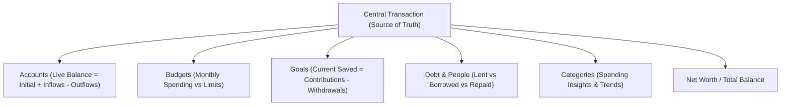

# Wallet

A fast, offline-first personal finance and expense logger built with **Native Android Jetpack Compose**, **Material 3 Expressive**, and **Room (SQLite)**.

---

## 🎨 Design & Theming

- **Typography:** Fully offline bundled **Google Sans Flex** variable font ([`res/font/google_sans_flex.ttf`](file:///D:/code/Wallet/main/app/src/main/res/font/google_sans_flex.ttf)).
- **Complete Suite of 10 Material 3 Dynamic Palette Variants:**
  1. **Expressive (Recommended):** Warm Amber & Spiced Cinnamon paired with Botanical Sage
  2. **Tonal Spot:** Velvety Honey Caramel & Soft Almond
  3. **Vibrant:** Sunlit Terracotta & Molten Gold
  4. **Rainbow:** Amber Gold, Sunset Coral, Sage & Copper Teal
  5. **Fruit Salad:** Warm Apricot Peach & Mint Teal
  6. **Spritz:** Soft Pastel Linen, Spiced Latte & Whispering Sage
  7. **Fidelity:** True-to-Seed Deep Amber Resin & Pure Warm Ochre
  8. **Content:** Sun-drenched Ochre, Baked Clay & Muted Moss
  9. **Monochrome:** Warm Sepia Slate & Obsidian Charcoal
  10. **Neutral:** Warm Travertine Stone & Warm Pebble Gray
- **Theme Modes:**
  - ☀️ **Light Mode:** Warm linen and cream surfaces
  - 🌙 **Dark Mode:** Deep warm espresso tones
  - 🖤 **AMOLED Mode:** Pure `#000000` pitch black for maximum OLED battery savings
  - 🪄 **Dynamic Color:** Android 12+ wallpaper color extraction

---

## 🧠 Single Source of Truth Architecture

Every financial calculation across the app is derived from immutable or event-sourced **`Transaction`** records:



---

## 📂 Project Structure

```
Wallet/main/
├── .github/workflows/android-ci.yml  # GitHub Actions CI/CD workflow
├── .gitignore                        # Git ignore patterns
├── build.gradle.kts                  # Root Gradle build script
├── settings.gradle.kts               # Project settings
├── gradle.properties                 # JVM & low-memory configuration
├── gradlew / gradlew.bat             # Gradle wrapper scripts
├── gradle/wrapper/                   # Gradle wrapper binaries & configuration
└── app/
    ├── build.gradle.kts              # Application build config & dependencies
    ├── src/main/
        ├── AndroidManifest.xml       # Application manifest
        ├── java/com/darkytm/wallet/
        │   ├── MainActivity.kt       # Single activity entry point
        │   ├── WalletApplication.kt  # Application container & Repository singleton
        │   ├── data/
        │   │   ├── dao/              # Transaction, Account, Category, Goal, Debt, Budget DAOs
        │   │   ├── model/            # Entities, Enums & Relation models
        │   │   ├── repository/       # WalletRepository (Reactive Calculation Engine)
        │   │   └── WalletDatabase.kt # Room Database with default seed data
        │   ├── navigation/           # Compose NavGraph
        │   ├── ui/
        │   │   ├── screens/          # HomeScreen, AddEntryScreen
        │   │   ├── theme/            # Theme, Color, Type (Google Sans Flex), PaletteStyle (10 M3 variants)
        │   │   ├── WalletViewModel.kt
        │   │   └── WalletViewModelFactory.kt
        │   └── util/                 # Currency formatter & input sanitizer
        └── res/
            ├── font/                 # Offline Google Sans Flex Variable TTF
            ├── drawable/             # Vector backgrounds and icons
            ├── mipmap-anydpi-v26/    # Adaptive launcher icons
            └── values/               # Colors, strings, themes
```

---

## 🚀 Building & Testing

- **Remote Build (GitHub Actions):** Push commits to GitHub to automatically trigger the CI/CD pipeline and download the build artifact.
- **Installing to Device via ADB:**
  ```bash
  adb install -r app/build/outputs/apk/debug/app-debug.apk
  ```
